

# BadgeUp

### Undergrad conferences for every major - attend free, win a scholarship, or find the student rate.

  <picture>
    <source media="(prefers-color-scheme: dark)" srcset="assets/banner-dark.png">
    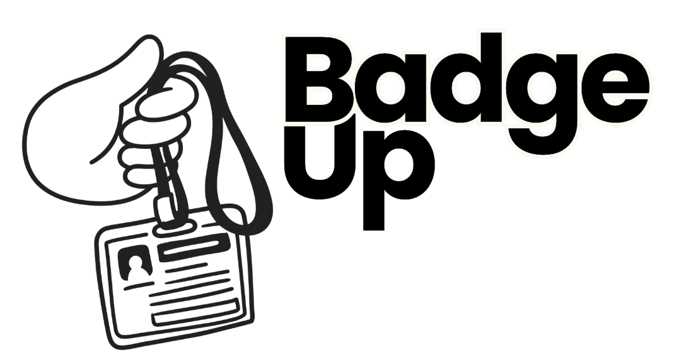
  </picture>

> [!IMPORTANT]
> **A curated, always-current list of conferences undergrads can actually get into - across every major, not just tech.** The ones you can attend for **free**, the ones with **student scholarships & travel grants**, and the **paid** ones worth the student ticket. Most conference roundups assume you already have a travel budget and a badge. This one doesn't.

Hi, I'm [Jose Cruz](https://www.linkedin.com/in/josegaelcruz). Conferences are where you meet recruiters, find mentors, and land interviews before the rest of your class knows they exist - and that's true whether you study computer science, business, biology, art, law, or anything else. But the cost and the "who's allowed in" question stops most undergrads before they start. So this list only tracks conferences a first-, second-, third-, or fourth-year student can realistically attend, sorted by major: free registrations, scholarship deadlines, travel grants, and student pricing, all in one place.

This is community-driven. If you know a conference - or you got funded to one - add it. Together we make the path clearer for everyone who comes after us.

---

**To contribute** - it takes 60 seconds:
 1. [Open an issue](https://github.com/Jose-Gael-Cruz-Lopez/BadgeUp/issues/new/choose) and paste the conference URL
 2. A maintainer approves it
 3. It gets added to the list

---

> [!WARNING]
> **Deadlines, dates, and scholarship rules change constantly.** Always confirm eligibility, cost, and deadlines on the **official conference site** before you plan travel or apply. This list points you to opportunities - it is not a substitute for the organizer's own page.

---

## Table of Contents

**By major**
- [Tech & Computing](#tech--computing)
- [Business & Finance](#business--finance)
- [Engineering](#engineering)
- [Health & Medicine](#health--medicine)
- [Sciences & Research](#sciences--research)
- [Social Sciences & Policy](#social-sciences--policy)
- [Law & Government](#law--government)
- [Arts, Humanities & Design](#arts-humanities--design)
- [Education](#education)
- [Multidisciplinary / General](#multidisciplinary--general)

**By community** (any major)
- [Women in Their Field](#women-in-their-field)
- [Black Professionals & Students](#black-professionals--students)
- [Latinx Professionals & Students](#latinx-professionals--students)
- [LGBTQ+ in Their Field](#lgbtq-in-their-field)

**More**
- [How to Read This List](#how-to-read-this-list)
- [Resources for Attendees](#resources-for-attendees)
- [Contributing](#contributing)
- [Contributors](#contributors)
- [Acknowledgements](#acknowledgements)
- [Gallery](#gallery)

---

## How to Read This List

**Status** - where the conference is in its cycle:

| Badge | Meaning |
| ----- | ------- |
| ✅ **[OPEN]** | Registration and/or scholarship applications are open right now |
| 🔥 **[CLOSING SOON]** | A deadline is within ~2 weeks - move fast |
| ⏳ **[OPENS SOON]** | Not open yet for the next cycle - watch the date |

**Access** - how an undergrad can afford to go (a conference may have more than one):

| Type | Meaning |
| ---- | ------- |
| **Free** | No ticket cost (you may still need to register or apply for a pass) |
| **Scholarship** | Free or heavily discounted via a scholarship or travel grant you apply for |
| **Paid** | Ticket required - student/academic pricing noted where it exists |

---

## Tech & Computing

| Status | Conference | Focus | Dates & Location | Access | Register / Apply | Deadline |
| ------ | ---------- | ----- | ---------------- | ------ | ---------------- | -------- |
| ✅ **[OPEN]** | GitHub Universe | Dev tools, AI, open source | Oct 2026 · San Francisco, CA + Virtual | Free (virtual pass) |  | Rolling |
| ✅ **[OPEN]** | Grace Hopper Celebration (GHC) | Women in computing | Sep 2026 · Orlando, FL + Virtual | Scholarship · Paid |  | Scholarships: check site |
| ✅ **[OPEN]** | ACM Richard Tapia Celebration of Diversity in Computing | Diversity in computing | Sep 2026 · Location TBA | Scholarship |  | Scholarship: check site |
| ✅ **[OPEN]** | KubeCon + CloudNativeCon NA | Cloud native, Kubernetes | Nov 2026 · Los Angeles, CA | Scholarship · Paid |  | Scholarship: Fall 2026 |
| ✅ **[OPEN]** | AWS re:Invent | Cloud, AI | Dec 2026 · Las Vegas, NV | Paid |  | Rolling |
| ⏳ **[OPENS SOON]** | PyCon US | Python | May 2027 · Location TBA | Scholarship |  | Early 2027 |
| ✅ **[OPEN]** | NeurIPS | AI / machine learning | Dec 2026 · San Diego, CA | Scholarship · Paid |  | Fall 2026 |

---

## Business & Finance

| Status | Conference | Focus | Dates & Location | Access | Register / Apply | Deadline |
| ------ | ---------- | ----- | ---------------- | ------ | ---------------- | -------- |
| ✅ **[OPEN]** | ALPFA National Convention | Latino business professionals | Aug 2026 · Location TBA | Scholarship · Paid |  | Summer 2026 |
| ✅ **[OPEN]** | National Black MBA Association Conference | Business, careers | Sep 2026 · Location TBA | Scholarship · Paid |  | Summer 2026 |
| ✅ **[OPEN]** | Prospanica Conference | Hispanic business professionals | Oct 2026 · Location TBA | Scholarship · Paid |  | Fall 2026 |
| ✅ **[OPEN]** | Net Impact Conference | Business + social/environmental impact | Fall 2026 · Location TBA | Paid (student) |  | Rolling |
| ✅ **[OPEN]** | INBOUND | Marketing, sales, business | Sep 2026 · San Francisco, CA + Virtual | Paid (student rate) |  | Rolling |

---

## Engineering

| Status | Conference | Focus | Dates & Location | Access | Register / Apply | Deadline |
| ------ | ---------- | ----- | ---------------- | ------ | ---------------- | -------- |
| ✅ **[OPEN]** | SHPE National Convention | Hispanic engineers | Oct-Nov 2026 · Location TBA | Scholarship · Paid |  | Travel awards: Summer 2026 |
| ✅ **[OPEN]** | Society of Women Engineers - WE26 | Engineering | Oct 2026 · Location TBA | Scholarship · Paid |  | Travel grants: Summer 2026 |
| ⏳ **[OPENS SOON]** | NSBE Annual Convention | Black engineers | Mar 2027 · Location TBA | Scholarship · Paid |  | Early 2027 |
| ✅ **[OPEN]** | SASE National Convention | Asian scientists & engineers | Oct 2026 · Location TBA | Scholarship · Paid |  | Fall 2026 |
| ✅ **[OPEN]** | AISES National Conference | Native American in STEM | Oct 2026 · Location TBA | Scholarship · Paid |  | Summer 2026 |

---

## Health & Medicine

| Status | Conference | Focus | Dates & Location | Access | Register / Apply | Deadline |
| ------ | ---------- | ----- | ---------------- | ------ | ---------------- | -------- |
| ⏳ **[OPENS SOON]** | SNMA Annual Medical Education Conference (AMEC) | Underrepresented in medicine | Apr 2027 · Location TBA | Scholarship · Paid |  | Early 2027 |
| ⏳ **[OPENS SOON]** | LMSA National Conference | Latino medical students | Spring 2027 · Location TBA | Scholarship · Paid |  | Early 2027 |
| ✅ **[OPEN]** | APHA Annual Meeting & Expo | Public health | Nov 2026 · Location TBA | Paid (student) |  | Rolling |
| ⏳ **[OPENS SOON]** | AMSA Annual Convention | Medical & pre-med students | Spring 2027 · Location TBA | Paid (student) |  | Early 2027 |
| ⏳ **[OPENS SOON]** | NSNA Annual Convention | Nursing students | Apr 2027 · Location TBA | Paid (student) |  | Early 2027 |

---

## Sciences & Research

| Status | Conference | Focus | Dates & Location | Access | Register / Apply | Deadline |
| ------ | ---------- | ----- | ---------------- | ------ | ---------------- | -------- |
| ✅ **[OPEN]** | SACNAS - The National Diversity in STEM Conference | Diversity in STEM research | Oct 2026 · Location TBA | Travel Scholarship |  | Summer 2026 |
| ✅ **[OPEN]** | ABRCMS | Biomedical research (underrepresented) | Nov 2026 · Location TBA | Travel Award |  | Summer 2026 |
| ✅ **[OPEN]** | AGU Annual Meeting | Earth & space science | Dec 2026 · Location TBA | Scholarship · Paid |  | Fall 2026 |
| ⏳ **[OPENS SOON]** | AAAS Annual Meeting | Science, cross-discipline | Feb 2027 · Location TBA | Paid (student) |  | Early 2027 |
| ⏳ **[OPENS SOON]** | ACS Spring National Meeting | Chemistry | Mar 2027 · Location TBA | Scholarship · Paid |  | Early 2027 |

---

## Social Sciences & Policy

| Status | Conference | Focus | Dates & Location | Access | Register / Apply | Deadline |
| ------ | ---------- | ----- | ---------------- | ------ | ---------------- | -------- |
| ✅ **[OPEN]** | APSA Annual Meeting | Political science | Sep 2026 · Location TBA | Paid (student) |  | Rolling |
| ✅ **[OPEN]** | ASA Annual Meeting | Sociology | Aug 2026 · Location TBA | Paid (student) |  | Rolling |
| ✅ **[OPEN]** | APA Convention | Psychology | Aug 2026 · Location TBA | Paid (student) |  | Rolling |
| ✅ **[OPEN]** | APPAM Fall Research Conference | Public policy & management | Nov 2026 · Location TBA | Scholarship · Paid |  | Fall 2026 |

---

## Law & Government

| Status | Conference | Focus | Dates & Location | Access | Register / Apply | Deadline |
| ------ | ---------- | ----- | ---------------- | ------ | ---------------- | -------- |
| ⏳ **[OPENS SOON]** | NBLSA National Convention | Black law students | Mar 2027 · Location TBA | Paid (student) |  | Early 2027 |
| ✅ **[OPEN]** | HNBA Annual Convention | Hispanic legal professionals | Sep 2026 · Location TBA | Scholarship · Paid |  | Summer 2026 |
| ✅ **[OPEN]** | Lavender Law (National LGBTQ+ Bar) | LGBTQ+ in law | Aug 2026 · Location TBA | Scholarship · Paid |  | Summer 2026 |
| ✅ **[OPEN]** | ABA Law Student events | Law, pre-law | Year-round · Various + Virtual | Paid (student) |  | Per event |

---

## Arts, Humanities & Design

| Status | Conference | Focus | Dates & Location | Access | Register / Apply | Deadline |
| ------ | ---------- | ----- | ---------------- | ------ | ---------------- | -------- |
| ⏳ **[OPENS SOON]** | AWP Conference & Bookfair | Creative writing, publishing | Mar 2027 · Location TBA | Paid (student) |  | Early 2027 |
| ⏳ **[OPENS SOON]** | MLA Annual Convention | Languages & literature | Jan 2027 · Location TBA | Paid (student) |  | Fall 2026 |
| ⏳ **[OPENS SOON]** | College Art Association (CAA) Annual Conference | Art & art history | Feb 2027 · Location TBA | Paid (student) |  | Early 2027 |
| ✅ **[OPEN]** | AIGA Design Conference | Graphic & communication design | Fall 2026 · Location TBA | Paid (student) |  | Rolling |
| ⏳ **[OPENS SOON]** | SXSW | Film, music, media, interactive | Mar 2027 · Austin, TX | Paid (student) |  | Rolling |

---

## Education

| Status | Conference | Focus | Dates & Location | Access | Register / Apply | Deadline |
| ------ | ---------- | ----- | ---------------- | ------ | ---------------- | -------- |
| ⏳ **[OPENS SOON]** | AERA Annual Meeting | Education research | Apr 2027 · Location TBA | Paid (student) |  | Early 2027 |
| ⏳ **[OPENS SOON]** | SXSW EDU | Teaching, learning, edtech | Mar 2027 · Austin, TX | Paid (student) |  | Rolling |
| ⏳ **[OPENS SOON]** | ISTELive | Educational technology | Jun 2027 · Location TBA | Paid (student) |  | Early 2027 |
| ✅ **[OPEN]** | NAFSA Annual Conference | International education | May 2027 · Location TBA | Paid (student) |  | Rolling |

---

## Multidisciplinary / General

Conferences open to students of any major - undergraduate research, leadership, and general career events.

| Status | Conference | Focus | Dates & Location | Access | Register / Apply | Deadline |
| ------ | ---------- | ----- | ---------------- | ------ | ---------------- | -------- |
| ⏳ **[OPENS SOON]** | NCUR (National Conference on Undergraduate Research) | Undergrad research, all majors | Spring 2027 · Location TBA | Paid (student) |  | Fall 2026 (abstracts) |
| ⏳ **[OPENS SOON]** | Clinton Global Initiative University (CGI U) | Leadership, social impact | 2027 · Location TBA | Scholarship · Free (accepted) |  | Winter 2026 |
| ✅ **[OPEN]** | ColorStack National Events | Black & Latinx computing students | Year-round · Members + Virtual | Free for members |  | Rolling membership |
| ⏳ **[OPENS SOON]** | Web Summit | General tech & startups | Nov 2026 · Lisbon, Portugal | Paid (student tickets) |  | Rolling |

---

## Women in Their Field

Conferences centering women across every major.

| Status | Conference | Field | Dates & Location | Access | Register / Apply | Deadline |
| ------ | ---------- | ----- | ---------------- | ------ | ---------------- | -------- |
| ✅ **[OPEN]** | Grace Hopper Celebration (GHC) | Tech / computing | Sep 2026 · Orlando, FL + Virtual | Scholarship · Paid |  | Scholarships: check site |
| ✅ **[OPEN]** | Society of Women Engineers - WE26 | Engineering | Oct 2026 · Location TBA | Scholarship · Paid |  | Travel grants: Summer 2026 |
| ✅ **[OPEN]** | Women in Data Science (WiDS) Worldwide | Data science | Regional year-round · Worldwide + Virtual | Free (most events) |  | Per event |
| ✅ **[OPEN]** | Forté Foundation events | Business / MBA | Year-round · Various + Virtual | Scholarship · Paid |  | Per event |
| ⏳ **[OPENS SOON]** | AMWA (American Medical Women's Association) | Medicine | Spring 2027 · Location TBA | Paid (student) |  | Early 2027 |

---

## Black Professionals & Students

| Status | Conference | Field | Dates & Location | Access | Register / Apply | Deadline |
| ------ | ---------- | ----- | ---------------- | ------ | ---------------- | -------- |
| ✅ **[OPEN]** | AfroTech Conference | Tech | Nov 2026 · Houston, TX | Scholarship · Paid |  | Scholarships: Fall 2026 |
| ⏳ **[OPENS SOON]** | NSBE Annual Convention | Engineering | Mar 2027 · Location TBA | Scholarship · Paid |  | Early 2027 |
| ✅ **[OPEN]** | National Black MBA Association Conference | Business | Sep 2026 · Location TBA | Scholarship · Paid |  | Summer 2026 |
| ⏳ **[OPENS SOON]** | SNMA Annual Medical Education Conference (AMEC) | Medicine | Apr 2027 · Location TBA | Scholarship · Paid |  | Early 2027 |
| ⏳ **[OPENS SOON]** | NBLSA National Convention | Law | Mar 2027 · Location TBA | Paid (student) |  | Early 2027 |

---

## Latinx Professionals & Students

| Status | Conference | Field | Dates & Location | Access | Register / Apply | Deadline |
| ------ | ---------- | ----- | ---------------- | ------ | ---------------- | -------- |
| ✅ **[OPEN]** | SHPE National Convention | Engineering | Oct-Nov 2026 · Location TBA | Scholarship · Paid |  | Travel awards: Summer 2026 |
| ✅ **[OPEN]** | ALPFA National Convention | Business | Aug 2026 · Location TBA | Scholarship · Paid |  | Summer 2026 |
| ✅ **[OPEN]** | SACNAS - The National Diversity in STEM Conference | Sciences / research | Oct 2026 · Location TBA | Travel Scholarship |  | Summer 2026 |
| ⏳ **[OPENS SOON]** | LMSA National Conference | Medicine | Spring 2027 · Location TBA | Scholarship · Paid |  | Early 2027 |
| ✅ **[OPEN]** | HNBA Annual Convention | Law | Sep 2026 · Location TBA | Scholarship · Paid |  | Summer 2026 |

---

## LGBTQ+ in Their Field

| Status | Conference | Field | Dates & Location | Access | Register / Apply | Deadline |
| ------ | ---------- | ----- | ---------------- | ------ | ---------------- | -------- |
| ✅ **[OPEN]** | oSTEM (Out in STEM) Annual Conference | STEM | Nov 2026 · Location TBA | Scholarship · Paid |  | Fall 2026 |
| ✅ **[OPEN]** | Lesbians Who Tech + Allies Summit | Tech | 2026 · San Francisco, CA + Virtual | Free/discounted student passes |  | Check site |
| ✅ **[OPEN]** | Lavender Law (National LGBTQ+ Bar) | Law | Aug 2026 · Location TBA | Scholarship · Paid |  | Summer 2026 |
| ⏳ **[OPENS SOON]** | Out & Equal Workplace Summit | Cross-industry | 2026 · Location TBA | Paid (student rate) |  | Rolling |

---

## Resources for Attendees

Guides for getting to a conference and making it count - whatever your major, even on a student budget.

- **Getting funded**
  - Ask your department, dean of students, or student government - most have a **conference travel fund** that undergrads forget to use.
  - Apply to the conference's own **student scholarship / travel grant** (linked in the tables above) - they exist precisely for you.
  - Affinity and professional orgs (SWE, NSBE, SHPE, SACNAS, oSTEM, ColorStack, ALPFA, SNMA, and more) often cover or subsidize travel for members.
- **Attending on the cheap**
  - Sign up as a **student volunteer** - many conferences waive registration in exchange for a few hours of help.
  - Choose the **virtual/livestream track** when travel isn't possible - it's free or cheap for many conferences.
- **Making it count**
  - Bring resumes and have a 20-second intro ready; the career fair is often the real reason to go.
  - Follow up on LinkedIn within 48 hours while you're still fresh in someone's memory.
- **Presenting (and getting funded to)**
  - Many conferences waive registration for presenters and speakers. Watch for **abstract** and **Call for Proposals (CFP)** deadlines - undergraduate research and first-time-presenter tracks exist across every field.

---

## Contributing

Know a conference undergrads can attend - in any major - or got funded to one? Add it. See **[CONTRIBUTING.md](CONTRIBUTING.md)** for the 60-second process. Closed or past conferences move to **[ARCHIVE.md](ARCHIVE.md)**.

## Contributors

Building and maintaining this list 💛

<table>
  <tr>
    <td align="center">
      <a href="https://www.linkedin.com/in/josegaelcruz">
        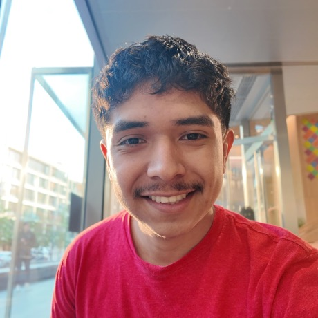 
        <b>Jose Cruz</b>
      </a>
    </td>
  </tr>
</table>

Want to join this wall? [Add a conference](https://github.com/Jose-Gael-Cruz-Lopez/BadgeUp/issues/new/choose) and you'll be credited as a contributor.

## Acknowledgements

Inspired by [Underclassmen Opportunities](https://github.com/Jose-Gael-Cruz-Lopez/underclassmen-opportunities) and the many community-run opportunity lists that came before it. Built for every undergrad, in every major, who was told to "wait until junior year." Thank you to everyone who contributes a conference.

  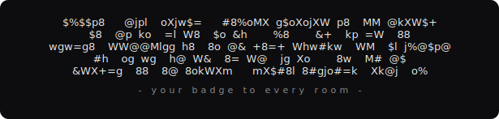

Real photos from conferences people found through this list. Went to one? [Share a photo](https://github.com/Jose-Gael-Cruz-Lopez/BadgeUp/issues/new?template=gallery_photo.yaml) and it'll show up here.

<!-- GALLERY_START -->

<a href="assets/gallery/shpe-2024-familia.png">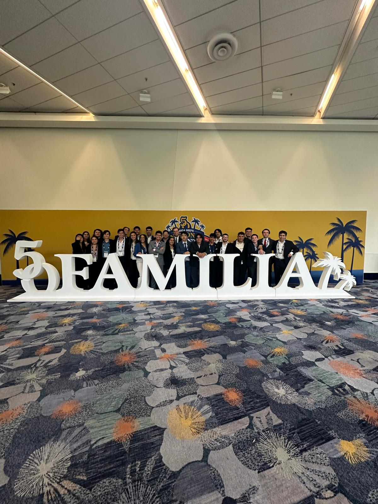</a>
<a href="assets/gallery/garden-of-the-gods.jpeg">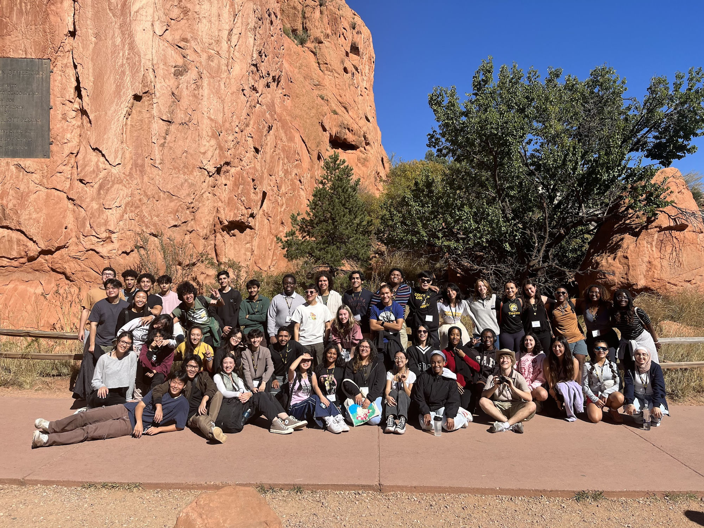</a>
<a href="assets/gallery/emerge-americas-walk.jpeg">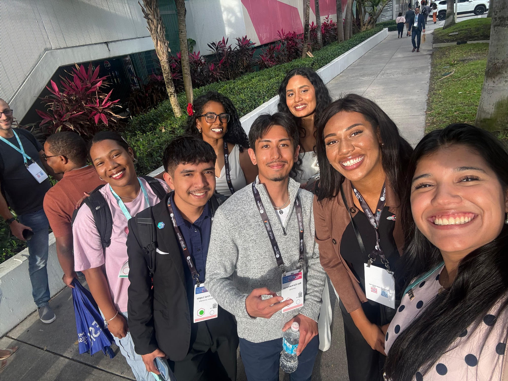</a>
<a href="assets/gallery/emerge-americas-selfie-1.png">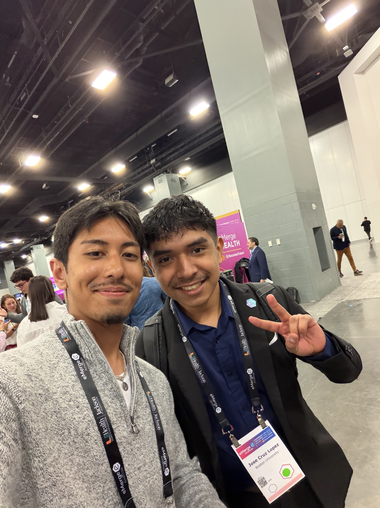</a>
<a href="assets/gallery/emerge-americas-selfie-2.png">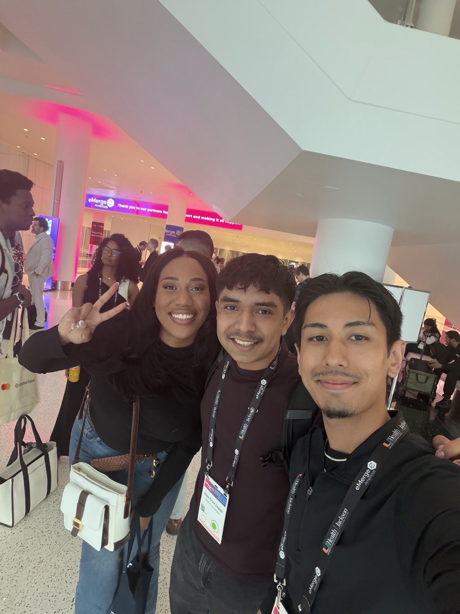</a>
<a href="assets/gallery/emerge-americas-hall.png">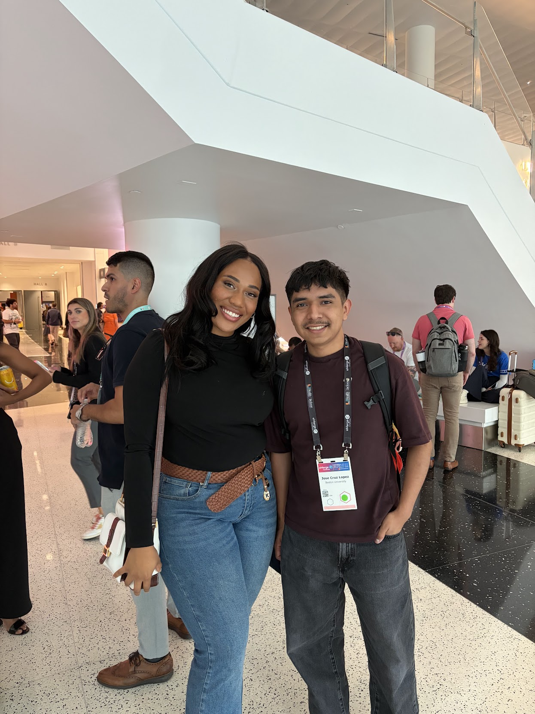</a>
<a href="assets/gallery/emerge-americas-mainstage.jpg">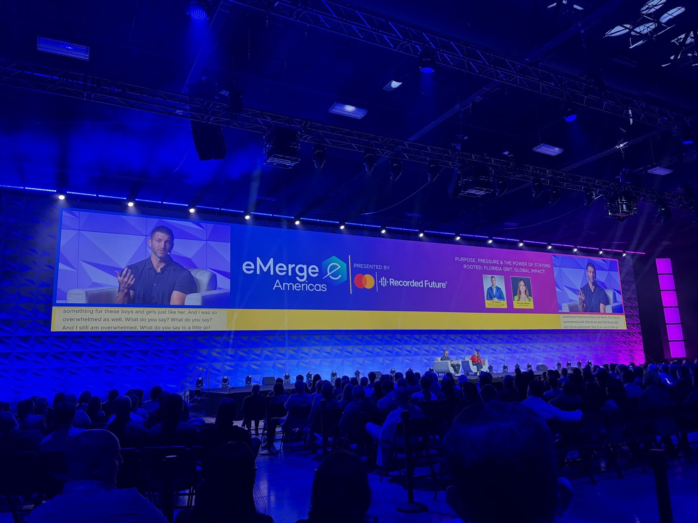</a>
<a href="assets/gallery/miami-dade-stem-competition.jpg">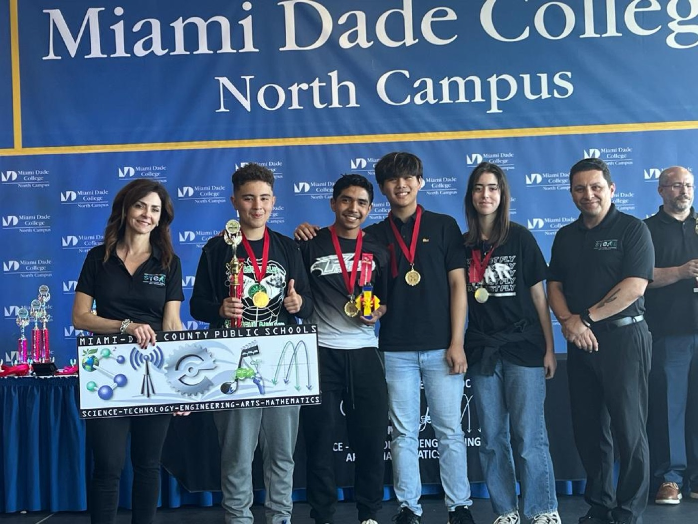</a>
<a href="assets/gallery/miami-dade-stem-winners.jpg">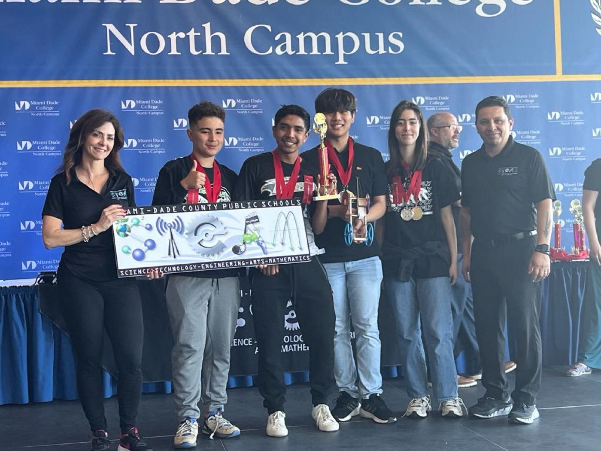</a>
<a href="assets/gallery/fresh-exp-day-istanbul.jpg">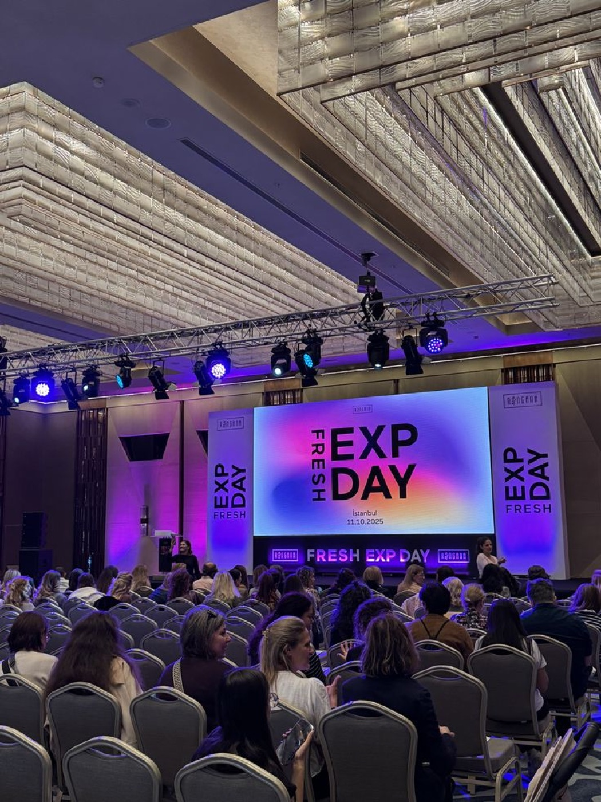</a>
<a href="assets/gallery/conference-keynote-session.jpg">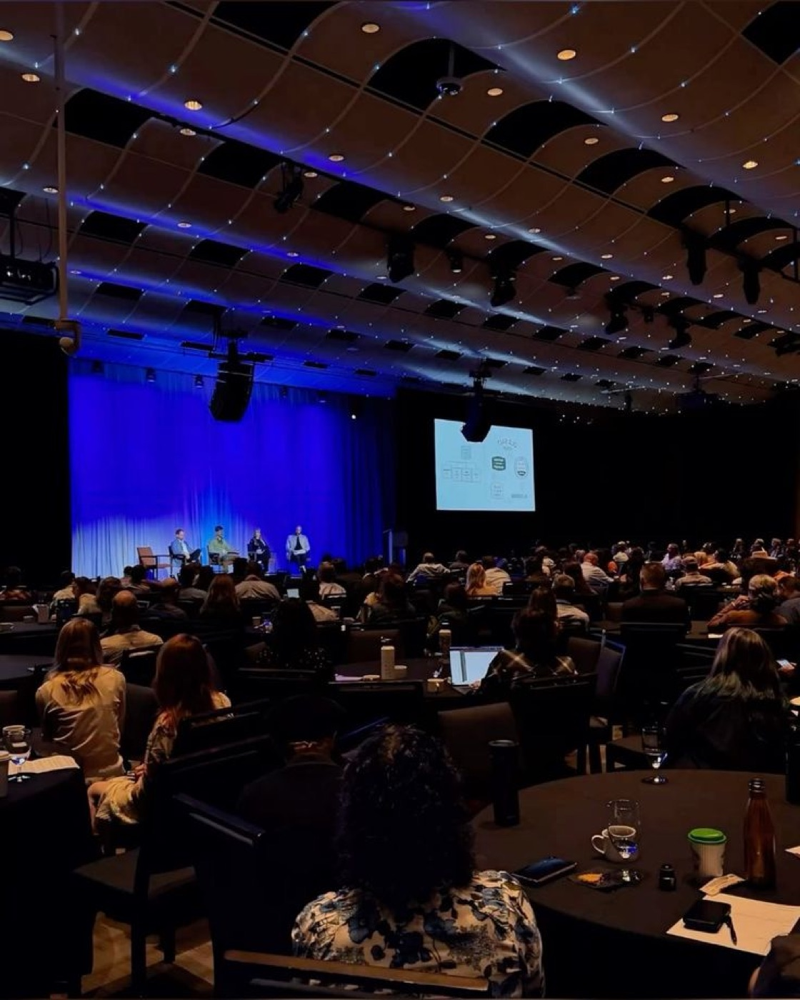</a>
<a href="assets/gallery/conference-travel-crew.jpg">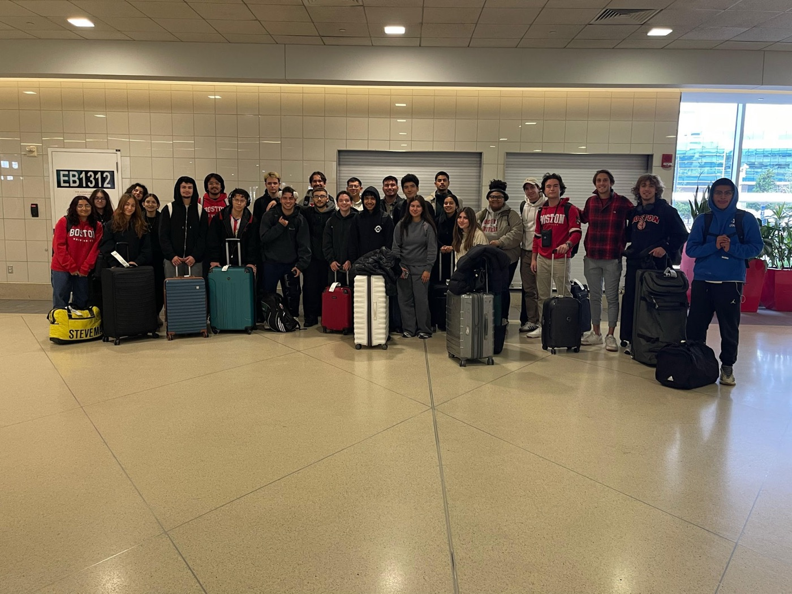</a>
<a href="assets/gallery/conference-group-meal.jpg">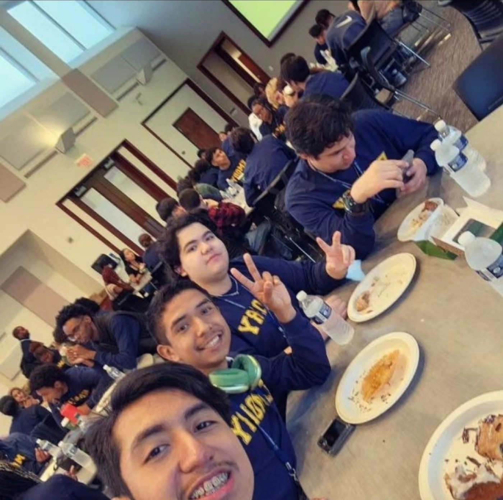</a>

<!-- GALLERY_END -->
